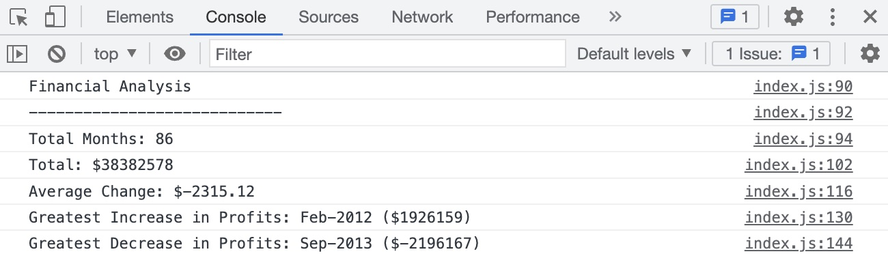

# console-finances

## Description 

This is code I've created for analyzing the financial records of a company after being provided the financial dataset. The JavaScript code created analyzes the records and calculated the below

The total number of months included in the dataset.
The net total amount of Profit/Losses over the entire period.
The average of the changes in Profit/Losses over the entire period.
The greatest increase in profits (date and amount) over the entire period.
The greatest decrease in losses (date and amount) over the entire period.

My motivation behind this was to advance my learning and showcase my skills using JavaScript.

## Screenshot

## Link
https://sophiedodsworth.github.io/console-finances/

## License 
MIT license